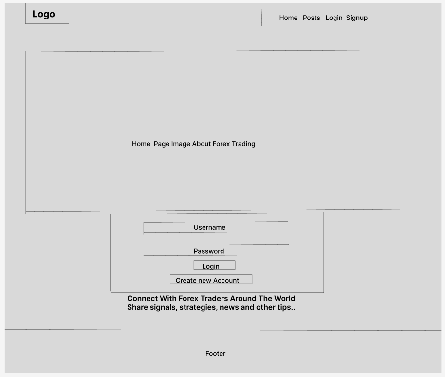

Display

Live URL : [ My Forex Life ](https://myfxlife-79a50a9b3ce5.herokuapp.com/)

MyForexLife is an application aimed at bringing together Forex Traders from allover the world into a community where they
can share ideas through posts. Users of this application are able to create an account using a username and password. Then
after creating an account they can login to be able to create posts, follow other users, like and comment on other posts.
To encourage quality content a post feed is available where only posts from users followed by an account owner will be 
displayed. Thus encouraging users to create good content in order to be followed. In the homepag we can also see the most liked
posts, and the most followed users. Thus a first time user can get the best of the application from the first time they use it.
Users are also able to see the posts they liked. Therefore encouraging users to click like on posts they are interested in.
A search bar is also provided for users to search posts by name. Then for security, users can always logout of their account to
keep individual accounts secured. If user feels his password is stolen, there is also a possibility to change password, username and even the profile image.

 ### N.B: This is the front end part of an application sending and receiving data from a backend application.
Link To Bacend: <https://myfxlifeapi-66a11d885add.herokuapp.com/>

## Project Goals

### User Goals

- The user wants to be able to create posts and view posts from other users.

- The user also wants to be able to follow other users, like and comment on their posts.

### Site Owner Goals

- The site owner wants to create a community for forex traders where trading analysis, strategies and even signals can be shared.

- The site owner also wants to encourage users to follow other users, like and comment on thier post. Thus provided special columns for most like and most followed

#### User Stories to achieve goals : [User Stories](https://github.com/F-Clement/myfxlife/issues)

## Design
* Home Page

Used [Figma](figma.com) to design how the website should look on a computer.

* Profile Page

By checking a profile, user should see following and followers count and profiles posts

* Signin and Signup
  
Used same design for our login and signup pages

  

## Technologies Used

- Languages

  - Python
  - HTML
  - JavaScript
  - CSS

- Tools

  - Gitpod
  - VS Code
  - Figma
  - React Bootstrap
  - Heroku
  - Git
  - Tiny png
  - Github
  - React

## Fronend Libraries Used
  * React
    
Used React to be able to make use of Hooks to build reusable components like (Navbar, Assets, Avatar) which will be used in the project. This gives room for seperation of concerns like seperate CSS files and functionalities build in seperate files. Thus allowing our code to be reusable and easy to fix incase of bugs. 

  * [Sweet Alert](https://sweetalert2.github.io/#examples)
    
Used sweet alert as it to prevent users from being logged out immediately they click on logout. This allows site owner and site user to be sure they want to logout and they just have to click yes to confirm

  * [React Bootstrap](https://react-bootstrap-v4.netlify.app/)
    
React bootstrap like the regular bootstrap is specially designed for React applications. Thus very compatible and we used it for our layouts

## Existing Features

- Login and Signup

  Users should be able to create and account and login to enjoy all functionalities of the application.

  

  

- Navigation Menu

  There is a navigation menu at the top to help users navigate the pages of the
  website easily. To the left is a logo and close to it an icon for users to click
  when they want to create a post.

  

- Create Post

  Users should be able to create a post by feeling the provided form. Upload an image, write some content and give it a title then submit the post. If they change their minds in the process they can also cancel.

  

- View Post

    By clicking on a post, a user will see details about the post. all comments, number of likes, post title and content. In the case wehre user owns the post, user can edit or delete this post.

    

  
- Search Posts

    User can search for a post and while searching we have a loader to let user understand the process is still going on. Then when search is done the posts are displayed. If not an image to let user know the search did not yield results is displayed.

    

    

- Profiles

    By clicking on user name or Avatar in posts, a user can see his or the details of the profile clicked i.e followers and followed count, number of posts and profile image.

    

- Drafts

    A user can create drafts posts and save them so that they are only seen by the owner and then late publish these posts.

- Notifications 

    A user is able to create a notification message which contains title and content. This is meant to be seen by only profiles that follow the owner of the notifications.

## Testing

- Testing aspects of the application to confirm goals are met and application works as expected.

<table>
    <tr>
        <th>Action</th>
        <th>Expected Results</th>
        <th>Actual Results</th>
    </tr>
    <tr>
        <td>First time user enters live link for the application into the browser</td>
        <td>The home page is expected to load with only logged out nav links(Home, Login, Signup) displaying</td>
        <td>Pass</td>
    </tr>
    <tr>
        <td>On signup page user provides valid information and submits</td>
        <td>User account is created and user is redirected to login page</td>
        <td>Pass</td>
    </tr>
    <tr>
        <td>On signup page user passwords do not match</td>
        <td>An error message is displayed telling user the passwords don't match</td>
        <td>Pass</td>
    </tr>
    <tr>
        <td>On signup page user does not provide a user name but inputs passwords and submits</td>
        <td>Erro message is displayed telling user that the username field can not be empty</td>
        <td>Pass</td>
    </tr>
    <tr>
        <td>On signup page user click submits without inputing content for any field</td>
        <td>Error messages are displayed, one for each field telling user it can't be empty</td>
        <td>Pass</td>
    </tr>
    <tr>
        <td>On login page user inputs a username and password that does not exist</td>
        <td>Error message is displayed to let user he can't login with the credentials</td>
        <td>Pass</td>
    </tr>
    <tr>
        <td>On login page user inputs username without password and submits</td>
        <td>Error message is displayed letting user know the field can not be empty</td>
        <td>Pass</td>
    </tr>
    <tr>
        <td>On login page user inputs valid username and password and submits</td>
        <td>User is login and redirected to the home page of the application</td>
        <td>Pass</td>
    </tr>
    <tr>
        <td>On home page user clicks on the Posts navigation link</td>
        <td>All posts load with the latest posts at the top</td>
        <td>Pass</td>
    </tr>
    <tr>
        <td>On home page user clicks on the Feed navigation link</td>
        <td>Posts from profiles the user is following are displayed on his Feed</td>
        <td>Pass</td>
    </tr>
    <tr>
        <td>User clicks on Liked Post navigaion link</td>
        <td>All posts user has liked are displayed</td>
        <td>Pass</td>
    </tr>
    <tr>
        <td>User Clicks on Add Post icon</td>
        <td>A form is loaded where user can create a post by uploading an image giving it a title and some content</td>
        <td>Pass</td>
    </tr>
    <tr>
        <td>On form to create post, a user submits without inputing any field</td>
        <td>An error message is displayed that the title field can not be empty</td>
        <td>Pass</td>
    </tr>
    <tr>
        <td>On form to create post, user uploads image add a title and some content then click create</td>
        <td>A post is created and user is redirected to that post page.</td>
        <td>Pass</td>
    </tr>
    <tr>
        <td>When a user likes a post</td>
        <td>The post likes count increases and the post appears in users Liked Post</td>
        <td>Pass</td>
    </tr>
    <tr>
        <td>When a user follows or unfollows a profile</td>
        <td>the users following count increases or decreases respectfully as the followed or unfollowed profile followers 
        count increases or decreases</td>
        <td>Pass</td>
    </tr>
    <tr>
        <td>Clicking on a profile navigation link, a user name or avatar</td>
        <td>The profile details like following and followers count, post count and the profiles posts below these details</td>
        <td>Pass</td>
    </tr>
    <tr>
        <td>Liking a post</td>
        <td>Post likes count should increase</td>
        <td>Pass</td>
    </tr>
    <tr>
        <td>Commenting on a post</td>
        <td>Post comments count should increase and comment should be displayed below the post</td>
        <td>Pass</td>
    </tr>
    <tr>
        <td>Clicking on the three dots at the top right of a profile page</td>
        <td>Options to edit profile, edit username and change passwords are provided</td>
        <td>Pass</td>
    </tr>
    <tr>
        <td>Selecting to change password, username or edit profile</td>
        <td>Respective forms are provided for user to input new information or upload image</td>
        <td>Pass</td>
    </tr>
    <tr>
        <td>Submiting form data after updating</td>
        <td>New information is uploaded to user profile immediately</td>
        <td>Pass</td>
    </tr>
    <tr>
        <td>Clicking on three dots besides the date on a detailed post</td>
        <td>Option to edit or delete post is provided. Clicking posts deletes post and edit posts provide form filled with post data so user can edit it</td>
        <td>Pass</td>
    </tr>
    <tr>
        <td>User click on cancel after wanting to edit a post</td>
        <td>Post is not edited and user is redirected to previous page</td>
        <td>Pass</td>
    </tr>
    <tr>
        <td>Edit post and click save</td>
        <td>Post is edited and user is redirected to the post page with already updated data</td>
        <td>Pass</td>
    </tr>
    <tr>
        <td>Clicking on Logout navigation</td>
        <td>Pop up is displayed so that user confirms they want to sign out before the signout. If user cancels they are not signed out</td>
        <td>Pass</td>
    </tr>
</table>

## Responsive

The application is responsive as you can see on different screen sizes.

## Bug

When user tries to publis a draft, the title and content is published but the image does not come along.

However if user changes image before publishing, everything works perfect

## Deployment

This application was deployed on Heroku. Below are the steps taken to successfully deploy.

1 - The requirement.txt file was populated using the command "pip3 freeze > requirements.txt"

2 - Heruku deploy commands were added and a Procfile created.

3 - Then we move to Heroku dashboard and create a new app. The app was named myfxlife just like the application and Europe was selected for region because the developer is in Germany.

4 - The next steps were clicking the deploy tab, selecting Github, searching the project by its name and then connecting to Heroku by clicking connect.

5 - Then clicking on Deploy Branch to complete the deploy. This application does not automatically deploy so each time the developer makes changes they have to come and deploy manually.

6 - Finally the application is deployed live to URL: <https://myfxlife-79a50a9b3ce5.herokuapp.com/>

## Credits

- Deployment

Thanks to Code Institute's Tutor support for assistance during deployment.

- Media

All images on this project were downloaded from google or from Code Institutes walkthrough project. However all images on the readme file itself are screenshots demonstrating different features of the application.

- Code

Thanks to Code Institutes walkthrough project we got a lot of boiler plate code and used it to feet our requirements.
Learned a lot from free content on the internet like [Stack Overflow](https://stackoverflow.com/)

Special thanks goes to my mentor, and thanks also to the Code Institute tutors and the CI Slack Channel for support.

